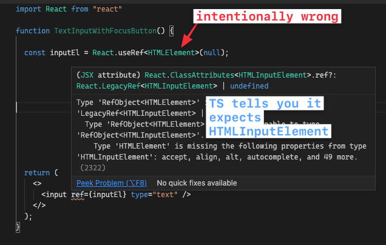

## Hooks

Hooks 在 [`@types/react` 16.8 之后就支持了](https://github.com/DefinitelyTyped/DefinitelyTyped/blob/a05cc538a42243c632f054e42eab483ebf1560ab/types/react/index.d.ts#L800-L1031)

[[toc]]

### useState

对于简单值，类型推断非常有效

```TSX
const [state, setState] = useState(false);
// `state` is inferred to be a boolean
// `setState` only takes booleans
```

如果需要使用依赖于推断的复杂类型，请参见使用 [Using Inferred Types](../troubleshooting/types.md)一节。


但是,需要 hooks 使用空值作为初始值,这时候该怎么定义类型呢?
显示的定义类型,并使用 union type :

```TSX
const [user, setUser] = useState<User | null>(null);

// later...
setUser(newUser);
```

你可以使用 as 断言初始值类型, 如果 其值在之后很快就初始化并一直有值.

```TSX
const [user, setUser] = useState<User>({} as User);

// later...
setUser(newUser);
```
上述代码暂时性的对 TS 编译器说谎, 说 `{}` 是 User 类型. 你应该紧接着设置好 `user` 的值.
如果不设置,后续的代码运行时会将 `user` 视为 `User` 类型,这可能导致 runtime error.


### useCallback
你可以像用其他函数一样使用 `useCallback`

```TSX
const memoizedCallback = useCallback(
  (param1: string, param2: number) => {
    console.log(param1, param2)
    return { ok: true }
  },
  [...],
);
/**
 * VSCode will show the following type:
 * const memoizedCallback:
 *  (param1: string, param2: number) => { ok: boolean }
 */
 ```

 在 React 小于 18 的版本, `useCallback` 的函数类型签名的参数类型为 `any[]`

 ```TSX
 function useCallback<T extends (...args: any[]) => any>(
  callback: T,
  deps: DependencyList
): T;
```

在 React 18 之后的版本(包括 18), `useCallback`的函数签名改为了:

```TSX
function useCallback<T extends Function>(callback: T, deps: DependencyList): T;
```

因此, 以下代码会在 React 18 之后的版本 造成 `Parameter 'e' implicitly has an 'any' type` 错误,而 React 18 之前的版本不会出错:

```TSX
// @ts-expect-error Parameter 'e' implicitly has 'any' type.
useCallback((e) => {}, []);
// Explicit 'any' type.
useCallback((e: any) => {}, []);
```

### useReducer

你可以为 reducer action 使用 [Discriminated Unions](https://www.typescriptlang.org/docs/handbook/typescript-in-5-minutes-func.html#discriminated-unions), 不要忘了定义 reducer 的返回类型,否则 TS 会自行推导.

```TSX
import { useReducer } from "react";

const initialState = { count: 0 };

type ACTIONTYPE =
  | { type: "increment"; payload: number }
  | { type: "decrement"; payload: string };

function reducer(state: typeof initialState, action: ACTIONTYPE) {
  switch (action.type) {
    case "increment":
      return { count: state.count + action.payload };
    case "decrement":
      return { count: state.count - Number(action.payload) };
    default:
      throw new Error();
  }
}

function Counter() {
  const [state, dispatch] = useReducer(reducer, initialState);
  return (
    <>
      Count: {state.count}
      <button onClick={() => dispatch({ type: "decrement", payload: "5" })}>
        -
      </button>
      <button onClick={() => dispatch({ type: "increment", payload: 5 })}>
        +
      </button>
    </>
  );
}
```

[view in TS playground](https://www.typescriptlang.org/play?#code/LAKFEsFsAcHsCcAuACAVMghgZ2QJQKYYDGKAZvLJMgOTyEnUDcooRsAdliuO+IuBgA2AZUQZE+ZAF5kAbzYBXdogBcyAAwBfZmBCIAntEkBBAMIAVAJIB5AHLmAmgAUAotOShkyAD5zkBozVqHiI6SHxlagAaZGgMfUFYDAATNXYFSAAjfHhNDxAvX1l-Q3wg5PxQ-HDImLiEpNTkLngeAHM8ll1SJRJwDmQ6ZIUiHIAKLnEykqNYUmQePgERMQkY4n4ONTMrO0dXAEo5T2aAdz4iAAtkMY3+9gA6APwj2ROvImxJYPYqmsRqCp3l5BvhEAp4Ow5IplGpJhIHjCUABqTB9DgPeqJFLaYGfLDfCp-CIAoEFEFeOjgyHQ2BKVTNVb4RF05TIAC0yFsGWy8Fu6MeWMaB1x5K8FVIGAUglUwK8iEuFFOyHY+GVLngFD5Bx0Xk0oH13V6myhplZEm1x3JbE4KAA2vD8DFkuAsHFEFcALruAgbB4KAkEYajPlDEY5GKLfhCURTHUnKkQqFjYEAHgAfHLkGb6WpZI6WfTDRSvKnMgpEIgBhxTIJwEQANZSWRjI5SdPIF1u8RXMayZ7lSphEnRWLxbFNagAVmomhF6fZqYA9OXKxxM2KQWWK1WoTW643m63pB2u+7e-3SkEQsPamOGik1FO55p08jl6vdxuKcvv8h4yAmhAA)

::: details 在 `redux` 中使用 `Reducer`

 redux 库提供了为编写 reducer 函数的 TS 类型 `Reducer<State, Action>`, 该类型能处理返回类型.

 ```TSX
import { Reducer } from 'redux';

export function reducer: Reducer<AppState, Action>() {}
 ```

 ### useEffect / useLayoutEffect

`useEffect` 和 `useLayoutEffect` 都是为了处理副作用的,其返回值返回可选的清除函数.如果不需要关心返回值, 类型自然也就不需要.
当使用 `useEffect`时,需要注意不要返回除了 `undefined` 和函数之外的任何类型,否则 TS 和 react 都报错. 在使用箭头函数时需注意:

```TSX
function DelayedEffect(props: { timerMs: number }) {
  const { timerMs } = props;

  useEffect(
    () =>
      setTimeout(() => {
        /* do stuff */
      }, timerMs),
    [timerMs]
  );
  // bad example! setTimeout implicitly returns a number
  // because the arrow function body isn't wrapped in curly braces
  return null;
}
```

::: details 上述代码的优化方案
```TSX
function DelayedEffect(props: { timerMs: number }) {
  const { timerMs } = props;

  useEffect(() => {
    setTimeout(() => {
      /* do stuff */
    }, timerMs);
  }, [timerMs]);
  // better; use the void keyword to make sure you return undefined
  return null;
}
```
:::


### useRef

在 TS 中,useRef 返回的 reference, 既不是一个 [read-only](https://github.com/DefinitelyTyped/DefinitelyTyped/blob/abd69803c1b710db58d511f4544ec1b70bc9077c/types/react/v16/index.d.ts#L1025-L1039)的, 也不是一个 [mutable](https://github.com/DefinitelyTyped/DefinitelyTyped/blob/abd69803c1b710db58d511f4544ec1b70bc9077c/types/react/v16/index.d.ts#L1012-L1023), 取决于类型参数是否完全覆盖初始值.

#### Option 1: DOM element ref

[为了访问一个 DOM element](https://legacy.reactjs.org/docs/refs-and-the-dom.html):
只提供元素类型作为参数, 并使用 null 作为初始值. 返回的 reference 会有一个由 react 管理的 read-only 的 `.current`. TS 期望你给这个 ref 赋予 element 的 ref prop:

```TSX
function Foo() {
  // - If possible, prefer as specific as possible. For example, HTMLDivElement
  //   is better than HTMLElement and way better than Element.
  // - Technical-wise, this returns RefObject<HTMLDivElement>
  const divRef = useRef<HTMLDivElement>(null);

  useEffect(() => {
    // Note that ref.current may be null. This is expected, because you may
    // conditionally render the ref-ed element, or you may forget to assign it
    if (!divRef.current) throw Error("divRef is not assigned");

    // Now divRef.current is sure to be HTMLDivElement
    doSomethingWith(divRef.current);
  });

  // Give the ref to an element so React can manage it for you
  return <div ref={divRef}>etc</div>;
}
```
如果你确定 `divRef.current` 永远不会为 null,你也可以使用 non-null assertion 操作符 `!`:
```TSX
const divRef = useRef<HTMLDivElement>(null!);
// Later... No need to check if it is null
doSomethingWith(divRef.current);
```
请注意，这里使用的是不使用类型安全, 如果忘记将 ref 分配给 element, 或者 element 是条件渲染的, 会产生 runtime error.

::: details 应该使用哪类 `HTMLEmenet` ?
refs 的使用要求严格, 只给出类型 `HTMLElement` 是不够的. 如果你不知道某个 element 的类型名称,
你可以查阅 [lib.dom.ts](https://github.com/microsoft/TypeScript/blob/v3.9.5/lib/lib.dom.d.ts#L19224-L19343), 或者故意构造一个类型错误并让 ide 提示你(如果装了类型提示插件):


:::

#### See also
* [Related issue by @rajivpunjabi](https://github.com/typescript-cheatsheets/react/issues/388) - [Playground](https://www.typescriptlang.org/play#code/JYWwDg9gTgLgBAKjgQwM5wEoFNkGN4BmUEIcARFDvmQNwCwAUI7hAHarwCCYYcAvHAAUASn4A+OAG9GjOHAD0CBLLnKGcxHABiwKBzgQwMYGxS4WUACbBWAczgwIcSxFwBXEFlYxkxtgDoVTQBJVmBjZAAbOAA3KLcsOAB3YEjogCNE1jc0-zgAGQBPG3tHOAAVQrAsAGVcKGAjOHTCuDdUErhWNgBabLSUVFQsWBNWA2qoX2hA9VU4AGFKXyx0AFk3H3TIxOwCOAB5dIArLHwgpHcoSm84MGJJmFbgdG74ZcsDVkjC2Y01f7yFQsdjvLAEACM-EwVBg-naWD2AB4ABLlNb5GpgZCsACiO083jEgn6kQAhMJ6HMQfpKJCFpE2IkBNg8HCEci0RisTj8VhCTBiaSKVSVIoAaoLnBQuFgFFYvFEikBpkujkMps4FgAB7VfCdLmY7F4gleOFwAByEHg7U63VYfXVg2Go1MhhG0ygf3mAHVUtF6jgYLtwUdTvguta4Bstjs9mGznCpVcbvB7u7YM90B8vj9vYgLkDqWxaeCAEzQ1n4eHDTnoo2801EknqykyObii5SmpnNifA5GMZmCzWOwOJwudwC3xjKUyiLROKRBLJf3NLJO9KanV64xj0koVifQ08k38s1Sv0DJZBxIx5DbRGhk6J5Nua5mu4PEZPOAvSNgsgnxsHmXZzIgRZyDSYIEAAzJWsI1k+BCovWp58gKcAAD5qmkQqtqKHbyCexoYRecw7IQugcAs76ptCdIQv4KZmoRcjyMRaGkU28A4aSKiUXAwwgpYtEfrcAh0mWzF0ax7bsZx3Lceetx8eqAlYPAMAABa6KJskSXAdKwTJ4kwGxCjyKy-bfK05SrDA8mWVagHAbZeScOY0CjqUE6uOgqDaRAOSfKqOYgb8KiMaZ9GSeCEIMkyMVyUwRHWYc7nSvAgUQEk6AjMQXpReWyWGdFLHeBZHEuTCQEZT8xVwaV8BxZCzUWZQMDvuMghBHASJVnCWhTLYApiH1chIqgxpGeCfCSIxAC+Yj3o+8YvvgSLyNNOLjeBGhTTNdLzVJy3reGMBbTtrB7RoB3XbNBAneCsHLatcbPhdV3GrdB1WYhw3IKNZq-W2DCLYRO7QPAljgsgORcDwVJAA)
* [Example from Stefan Baumgartner](https://fettblog.eu/typescript-react/hooks/#useref) - [Playground](https://www.typescriptlang.org/play/?jsx=2#code/JYWwDg9gTgLgBAJQKYEMDG8BmUIjgIilQ3wFgAoCzAVwDsNgJa4AVJADxgElaxqYA6sBgALAGIQ01AM4AhfjCYAKAJRwA3hThwA9DrjBaw4CgA2waUjgB3YSLi1qp0wBo4AI35wYSZ6wCeYEgAymhQwGDw1lYoRHCmEBAA1oYA5nCY0HAozAASLACyADI8fDAAoqZIIEi0MFpwaEzS8IZllXAAvIjEMAB0MkjImAA8+cWl-JXVtTAAfEqOzioA3A1NtC1wTPIwirQAwuZoSV1wql1zGg3aenAt4RgOTqaNIkgn0g5ISAAmcDJvBA3h9TsBMAZeFNXjl-lIoEQ6nAOBZ+jddPpPPAmGgrPDEfAUS1pG5hAYvhAITBAlZxiUoRUqjU6m5RIDhOi7iIUF9RFYaqIIP9MlJpABCOCAUHJ0eDzm1oXAAGSKyHtUx9fGzNSacjaPWq6Ea6gI2Z9EUyVRrXV6gC+DRtVu0RBgxuYSnRIzm6O06h0ACpIdlfr9jExSQyOkxTP5GjkPFZBv9bKIDYSmbNpH04ABNFD+CV+nR2636kby+BETCddTlyo27w0zr4HycfC6L0lvUjLH7baHY5Jas7BRMI7AE42uYSUXed6pkY6HtMDulnQruCrCg2oA)

### useImperativeHandle

基于 [Stackoverflow 的答案](https://stackoverflow.com/a/69292925/5415299):

```TSX
// Countdown.tsx

// Define the handle types which will be passed to the forwardRef
export type CountdownHandle = {
  start: () => void;
};

type CountdownProps = {};

const Countdown = forwardRef<CountdownHandle, CountdownProps>((props, ref) => {
  useImperativeHandle(ref, () => ({
    // start() has type inference here
    start() {
      alert("Start");
    },
  }));

  return <div>Countdown</div>;
});
```

```TSX
// The component uses the Countdown component

import Countdown, { CountdownHandle } from "./Countdown.tsx";

function App() {
  const countdownEl = useRef<CountdownHandle>(null);

  useEffect(() => {
    if (countdownEl.current) {
      // start() has type inference here as well
      countdownEl.current.start();
    }
  }, []);

  return <Countdown ref={countdownEl} />;
}
```

#### See also
* [Using ForwardRefRenderFunction](https://stackoverflow.com/a/62258685/5415299)

### Custom Hooks
如果你在自定义的 hook 中返回了数组，你可能会想要避免 TS 的类型推导（当返回的数组中包含不同类型元素时）
[TS 3.4 const assertions](https://devblogs.microsoft.com/typescript/announcing-typescript-3-4/#const-assertions):

```TSX
import { useState } from "react";

export function useLoading() {
  const [isLoading, setState] = useState(false);
  const load = (aPromise: Promise<any>) => {
    setState(true);
    return aPromise.finally(() => setState(false));
  };
  return [isLoading, load] as const; // infers [boolean, typeof load] instead of (boolean | typeof load)[]
}
```
[TS Playground](https://www.typescriptlang.org/play/?target=5&jsx=2#code/JYWwDg9gTgLgBAJQKYEMDG8BmUIjgcilQ3wFgAoCpAD0ljkwFcA7DYCZuRgZyQBkIKACbBmAcwAUASjgBvCnDhoO3eAG1g3AcNFiANHF4wAyjBQwkAXTgBeRMRgA6HklPmkEzCgA2vKQG4FJRV4b0EhWzgJFAAFHBBNJAAuODjcRIAeFGYATwA+GRs8uSDFIzcLCRgoRiQA0rgiGEYoTlj4xMdMUR9vHIlpW2Lys0qvXzr68kUAX0DpxqRm1rgNLXDdAzDhaxRuYOZVfzgAehO4UUwkKH21ACMICG9UZgMYHLAkCEw4baFrUSqVARb5RB5PF5wAA+cHen1BfykaksFBmQA)

当你解构它时, 你可以拿到正确的类型.

::: details 备选方案：断言数组返回类型
如果你在 [const assertions 的使用上有问题](https://github.com/babel/babel/issues/9800), 还可以尝试使用 assert 或者定义函数返回类型的方式:

```TSX
import { useState } from "react";

export function useLoading() {
  const [isLoading, setState] = useState(false);
  const load = (aPromise: Promise<any>) => {
    setState(true);
    return aPromise.finally(() => setState(false));
  };
  return [isLoading, load] as [
    boolean,
    (aPromise: Promise<any>) => Promise<any>
  ];
}
```

如果有大量自定义 hooks，那么自动输入数组的辅助函数也会很有帮助:

```TSX
function tuplify<T extends any[]>(...elements: T) {
  return elements;
}

function useArray() {
  const numberValue = useRef(3).current;
  const functionValue = useRef(() => {}).current;
  return [numberValue, functionValue]; // type is (number | (() => void))[]
}

function useTuple() {
  const numberValue = useRef(3).current;
  const functionValue = useRef(() => {}).current;
  return tuplify(numberValue, functionValue); // type is [number, () => void]
}
```

:::

尽管 react team 推荐在使用自定义 hooks 时返回值如果多余两个,应该使用 object 而不是数组.

### More Hooks + TS reading:

* [https://medium.com/@jrwebdev/react-hooks-in-typescript-88fce7001d0d](https://medium.com/@jrwebdev/react-hooks-in-typescript-88fce7001d0d)
* [https://fettblog.eu/typescript-react/hooks/#useref](https://fettblog.eu/typescript-react/hooks/#useref)

如果你正在写 React Hooks library, 不要忘记暴露类型给用户使用.

### Example React Hooks + TypeScript Libraries:

* https://github.com/mweststrate/use-st8
* https://github.com/palmerhq/the-platform
* https://github.com/sw-yx/hooks


